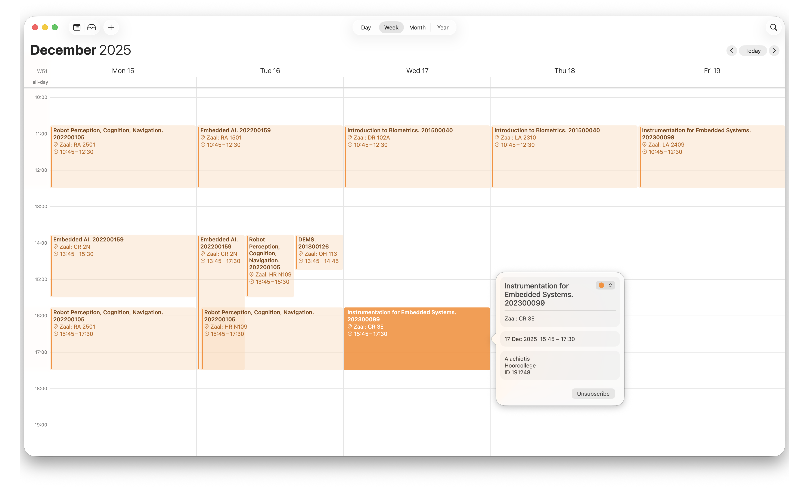
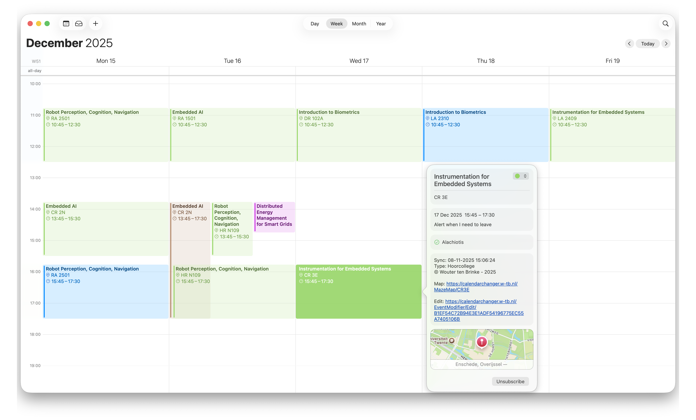

# CalendarChanger

> A personal fix for the messy University of Twente (TimeEdit) calendar exports.

| Before | After |
|:--:|:--:|
|  |  |

CalendarChanger is a small web app that sits between **TimeEdit** and your preferred calendar app.  
It takes the `.ics` feeds from TimeEdit, cleans them up, and republishes them as nice, structured calendars you can actually use.  
All your events stay up to date automatically, but with proper names, times, and mazemap links.

## Why

TimeEdit’s calendar export is functional, but not practical.  
Events come with unreadable titles, random types, and no MazeMap links.  
I built CalendarChanger to solve that — and because the `.ics` format works everywhere (Apple Calendar, Google Calendar, Outlook, etc.) without vendor lock-in.

## What It Does

-   **Cleans event titles** – turns `Wireless Communication Systems, 202400588` into `Wireless Communication Systems`.
-   **Renaming rules** – rename all events matching `DEMS` to `Distributed Energy Management Systems`
-   **Lets you override details** – rename events, adjust times, or hide them completely.
    -   Example: TimeEdit says `8:45–17:00` but you only present from `14:00–15:00`, now you can rename the event to `Presentation` and edit the start and end time.
    -   Passed an exam and don’t need the resit? Hide it and keep your calendar tidy.
-   **Adds MazeMap links** – opens the correct UTwente room or building directly.
-   **Splits calendars by type** – create feeds like `/Lectures`, `/Exams`, `/Workshops` so you can color-code them differently in your calendar app.
-   **Runs anywhere** – lightweight, single Docker container, self-hosted in minutes.

## Setup

### Quick Deploy with Docker Compose

Create a file named `docker-compose.yml`:

```yaml
services:
    calendar-changer:
        image: ghcr.io/wtb04/calendarchangerbackend:latest
        ports:
            - "8080:8080"
        environment:
            ApiKey: "password"
        volumes:
            - ./data:/app/data
```

then run

```bash
docker compose up -d
```

Visit [http://localhost:8088](http://localhost:8088) and log in using the `ApiKey` you configured.

In **Settings**, fill in the following fields:

-   **Base URL** – for local setups, use `http://localhost:8080`.  
    This value controls how links inside calendar events are generated (for example, MazeMap directions and edit links).  
    It **does not** affect how you access the web portal itself.  
    However, the address you set here **should still resolve** to your running instance of CalendarChanger,  
    since calendar clients will follow those links back to the web portal to open event details or maps.
-   **Rooster URLs** – add one or more `.ics` links from TimeEdit.  
    When copying these URLs, make sure to set the period to match your current semester (for example `2025/2026 1A`).  
    This ensures the feed includes _all_ events for that period, not just the next four weeks.

Once saved, your merged and cleaned calendar will be available at:  
[http://localhost:8080/other](http://localhost:8080/other)

You can also create custom endpoints to separate event types.  
For example, add an endpoint named **exams** and include the types:  
`exam, exam chromebook, presentation(s)`

These matching events will then be removed from `/other` and instead appear under:  
[http://localhost:8080/exams](http://localhost:8080/exams)
